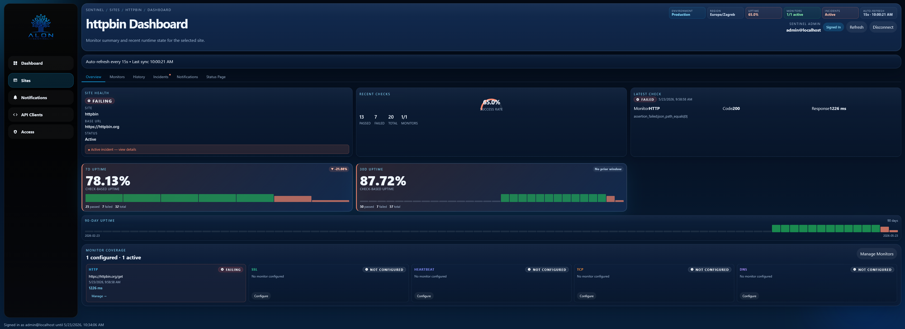
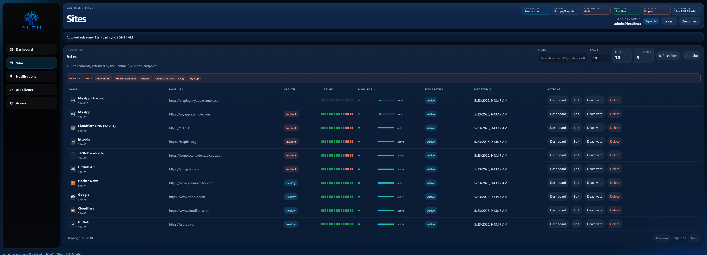
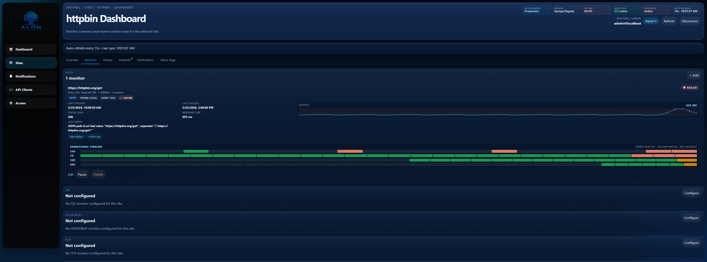
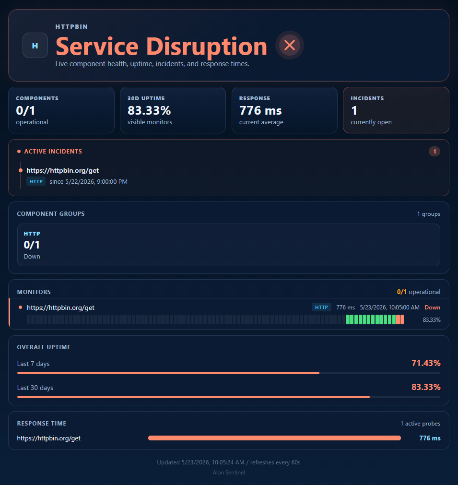
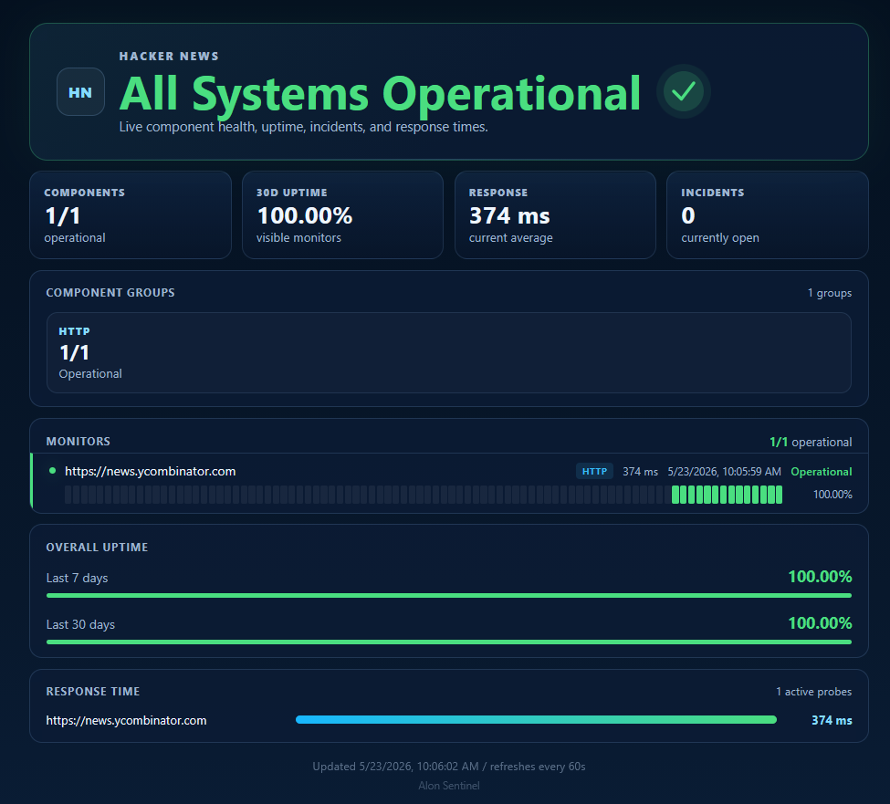
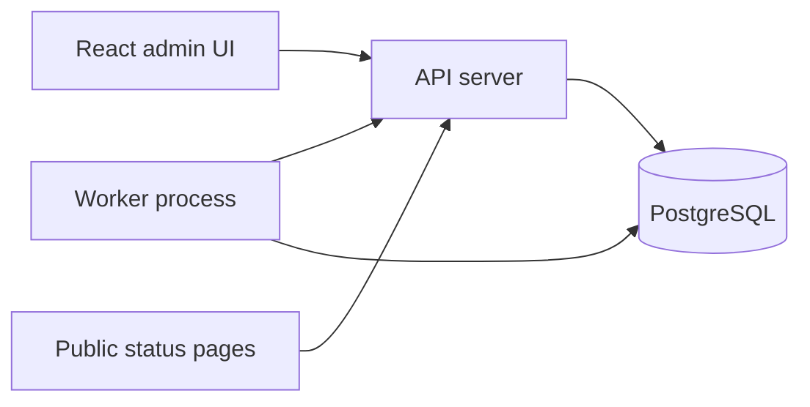

# Alon Sentinel

[](https://github.com/tomnekic/alon-sentinel/actions/workflows/ci.yml)
[](LICENSE)
[](https://www.rust-lang.org)
[](docker-compose.yml)

Open-source infrastructure monitoring with incident management, public status
pages, and an API-first architecture.

Monitor websites, APIs, SSL certificates, DNS records, TCP services, and
heartbeat jobs from a self-hosted platform built in Rust.

[Live Demo](https://demo.alon.systems) | [API Docs](https://docs.alon.systems) | [Documentation](alon_sentinel/README.md) | [Docker Install](#quick-start)



---

## Live Demo

Try Alon Sentinel without installing anything:

- Dashboard
- Incidents
- Monitor history
- Public status pages

```text
https://demo.alon.systems
```

```text
Email:    demo@alon.systems
Password: Demo123$
```

Read-only access.

---

## What Makes Sentinel Different

### Site-Centric Design

Instead of managing monitors as isolated checks, Sentinel groups monitors around
the service they protect.

Example: a single `GitHub API` site can have:

- HTTP monitor
- SSL monitor
- DNS monitor
- TCP monitor
- Heartbeat monitor

All checks roll up into one operational view with shared history, incidents,
notifications, and public status output.

### Built For Operations

Failures open incidents automatically. Recoveries resolve them. Open incidents
can be acknowledged to signal awareness. Every state change can trigger Slack,
Discord, webhook, or email notifications.

### API-First

The React admin UI is optional. Every capability is available through the
versioned `/v1` HTTP API with an OpenAPI specification.

---

## Why Alon Sentinel?

- Site-centric monitoring
- Multiple monitor types per service
- Incident lifecycle tracking
- Public status pages
- JSON path assertions
- Header and body assertions
- API-first architecture
- OpenAPI specification
- Rust backend
- Self-hosted and AGPL licensed

---

## Screenshots

### Sites Overview



Manage many services with per-site health, monitor coverage, current incident
state, and operational ownership in one view.

### Monitor Detail And History



Track latency, check history, failures, retries, and recovery timelines from
the same site context.

### Public Status Pages



Incidents are reflected publicly with degraded or outage states and affected
monitors.



Publish clean public status pages for customers or internal teams.

---

## Current Monitor Types

- HTTP: status code, response body, JSON path assertions, header assertions,
  response time, and SSL expiry checks
- SSL: certificate validity and days until expiry
- DNS: record resolution and expected value matching
- TCP: port reachability
- Heartbeat: passive ping endpoint for cron jobs and background services

---

## Roadmap

- Ping checks
- SMTP checks
- Multi-region checks
- Agent monitoring

See [`ROADMAP.md`](ROADMAP.md) for project direction.

---

## Architecture



- Rust backend on Tokio
- PostgreSQL storage with lease-based worker coordination
- Separate API and worker processes
- React 19 admin UI served behind nginx in Docker
- Versioned REST API with OpenAPI documentation
- In-process per-IP rate limiting on auth endpoints
- Optional trusted-proxy mode for reverse-proxy deployments

---

## Features

**Operations**

- Incident lifecycle: failures open incidents; recoveries resolve them
  automatically
- Operational timelines across 24h, 7d, 30d, and 90d windows
- Public status pages for user-facing uptime communication
- Configurable check history retention

**Notifications**

- Slack, Discord, webhook, and email notification channels
- Per-site overrides for routing alerts to different channels

**API & Auth**

- Machine-to-machine API clients with scoped bearer tokens
- Role-based admin users: viewer, operator, and admin
- Stable `/v1` API surface with documented compatibility guarantees

**Deployment**

- Docker Compose stack
- Standard PostgreSQL storage
- Reverse proxy support
- Self-hosted by default

---

## Performance

Validated at 10,000 monitors on a single 4 vCPU / 8 GB RAM server:

- 453,054 checks completed
- 453,666 checks expected
- 99.86% execution rate
- 0.1% missed checks
- 286.8 MB RAM
- 67.9% CPU
- 0 worker errors

See [`benchmark/`](benchmark/) for benchmark details and raw results.

---

## Quick Start

Requires Docker with the Compose plugin.

```bash
cp .env.example .env
```

Set the required values in `.env`:

```env
POSTGRES_PASSWORD=a-strong-password

# Generate with: openssl rand -hex 32
WEBHOOK_SECRET_ENCRYPTION_KEY=64-lowercase-hex-chars
```

Start the stack:

```bash
docker compose up -d
docker compose logs init
```

Open:

```text
http://localhost:8080
```

The admin UI proxies API requests internally, so only port `8080` needs to be
reachable for normal browser use.

---

## API Usage

The admin UI is optional. Every capability is available over HTTP.

```bash
# Provision an API client
cd alon_sentinel && cargo run --bin provision_client

# Exchange credentials for a bearer token
curl -X POST http://127.0.0.1:3000/v1/auth/token \
  -H 'Content-Type: application/json' \
  -d '{"client_id":"...","client_secret":"..."}'

# All subsequent requests
curl http://127.0.0.1:3000/v1/sites \
  -H 'Authorization: Bearer <token>'
```

The `/v1` contract carries documented stability guarantees. Additive changes
ship within the current version; breaking changes require `/v2`.

See [`alon_sentinel/docs/api/README.md`](alon_sentinel/docs/api/README.md) for
the full authentication model, scopes, error semantics, and serialization rules.

---

## Prometheus Metrics

Alon Sentinel exposes Prometheus-compatible metrics at `GET /metrics` for
trusted scrape targets.

The default production Caddy overlay blocks public access to `/metrics`; scrape
it from a private network, VPN, or reverse proxy with explicit access controls.

Use it with Prometheus, Grafana, Alertmanager, VictoriaMetrics, or Thanos.

See [`docs/prometheus.md`](docs/prometheus.md) for metric descriptions, sample
output, scrape config, and latency queries.

---

## From Source

Requires Rust stable, PostgreSQL 14+, and Node.js 20+.

See [`alon_sentinel/README.md`](alon_sentinel/README.md) for the full setup
guide.

---

## Behind A Reverse Proxy

### Docker Compose (production)

A production overlay is included that adds Caddy as the sole public ingress
with automatic HTTPS, and removes the direct host port bindings from the API
and admin containers.

Point two DNS A records at your server before deploying:

```text
demo.alon.systems     → <server public IP>
api.demo.alon.systems → <server public IP>
```

Then deploy with:

```bash
docker compose -f docker-compose.yml -f docker-compose.prod.yml up -d --build
```

Caddy provisions and renews TLS certificates automatically. No additional
configuration is required.

### Manual / source builds

Set the following environment variables before starting the API to read real
client IPs from `X-Forwarded-For` instead of the socket address:

```env
TRUST_PROXY_HEADERS=true
TRUSTED_PROXY_IPS=<proxy_ip>
```

`TRUSTED_PROXY_IPS` is a comma-separated list of IP addresses. Requests from
any other source are not trusted even if they set forwarding headers.

---

## Project Status

- Active development
- AGPL v3 licensed
- Public roadmap
- OpenAPI documented
- Docker deployment
- PostgreSQL backend
- Integration test coverage

---

## Repository Layout

```text
alon_sentinel/          Rust backend: API server, workers, migrations
alon_sentinel_admin/    React 19 admin UI
benchmark/              Reproducible throughput and latency benchmarks
docs/screenshots/      README screenshots
```

- [`alon_sentinel/README.md`](alon_sentinel/README.md): backend setup, binaries, configuration reference
- [`alon_sentinel_admin/README.md`](alon_sentinel_admin/README.md): UI setup and deployment
- [`alon_sentinel/docs/api/README.md`](alon_sentinel/docs/api/README.md): API contract and authentication model
- [`alon_sentinel/docs/api/openapi-v1.yaml`](alon_sentinel/docs/api/openapi-v1.yaml): OpenAPI specification

---

## License

Alon Sentinel is free software licensed under the GNU Affero General Public
License v3.0 or later.

See [`LICENSE`](LICENSE) for the controlling terms and
[`CONTRIBUTING.md`](CONTRIBUTING.md) for contribution terms.
